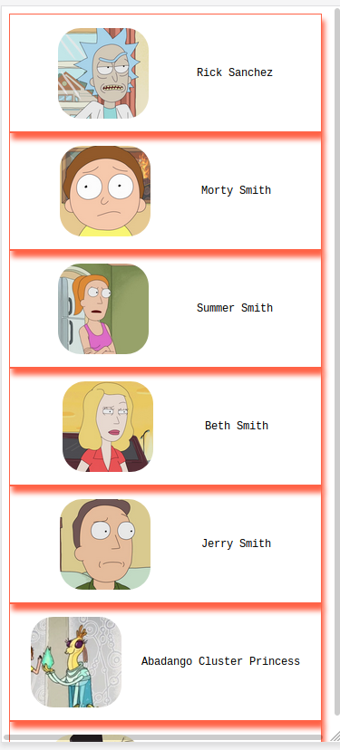

# Rick & Morty Virtualized List Explorer

A performant, modern React app for exploring Rick & Morty characters using a virtualized list, built with:
- **React 19** + **Vite**
- **Apollo Client 4** (GraphQL)
- **TanStack Router**
- **Tailwind CSS**
- **react-window** for virtualization

## Features
- Virtualized, paginated character list (fast, memory-efficient)
- Search, filter (by name/status), and sort
- Responsive, accessible UI with Tailwind
- Character detail pages with full info
- Modern React patterns (hooks, suspense, code splitting)

## Quick Start
```sh
git clone https://github.com/As1aNH4wK/Virtualizing-list-in-virtual-DOM.git
pnpm install
pnpm dev
```

## Project Structure
```
.agents/skills/         # AI agent skill definitions
src/
  components/           # UI components (VirtualizedList, etc)
  hooks/                # Custom React hooks
  pages/                # Home, CharacterDetail
  router/               # Central route definitions
  styles/               # Tailwind entry
  App.tsx               # App root
  index.tsx             # Vite entry
```

## Scripts
- `pnpm dev` – Start dev server
- `pnpm build` – Build for production
- `pnpm preview` – Preview production build
- `pnpm lint` – Lint code

## Credits
- Based on [Brian Vaughn's react-window](https://github.com/bvaughn/react-window)
- Uses the [Rick & Morty GraphQL API](https://rickandmortyapi.com/graphql)

---

